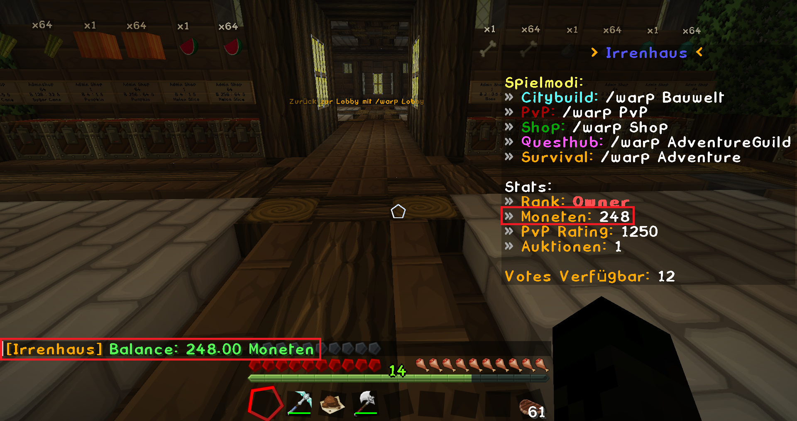

# Moneten

Moneten sind die Server-Währung. Sie werden durch Verkäufe ([Shops](chestshops.md), [Auktion](auktionen.md)), [Quests](../funktionen/quests.md), oder als [Voting-Belohnunge](../sonstiges/voting.md) vergeben. Mit Moneten kannst du im Spiel Ressourcen kaufen.

## Befehle
Mit 
```
/balance
``` 
oder in der lobby siehst du dein aktuelles Guthaben.

{style="max-width:100%;height:auto;display:block;"}

Mit 
```
/pay <Spieler> <Betrag> 
```
überweist du Moneten an einen anderen Spieler.